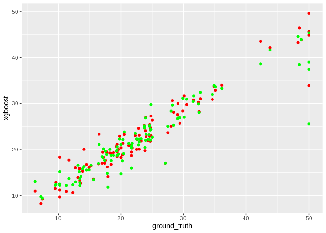
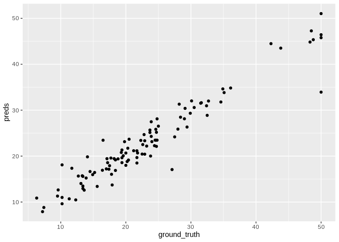
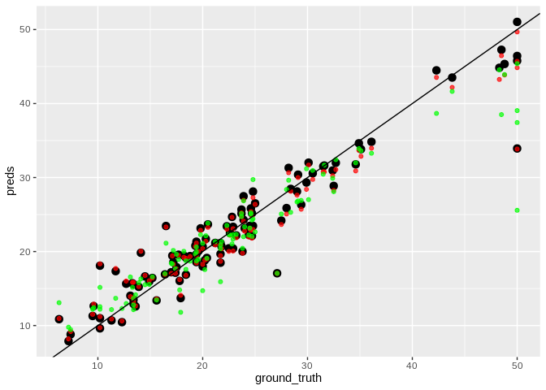

<!-- README.md is generated from README.Rmd. Please edit that file -->

# stackeR

<!-- badges: start -->

<!-- badges: end -->

**stackeR** package implements classical model stacking algorithm called
[SuperLearner](dx.doi.org/10.2202/1544-6115.1309). It works around
**resampleR** and **grideR** and has as little dependecies as possible.

## Installation

You can install dev version of **stackeR** from GitHub
[GitHub](https://github.com/) with:

``` r
# install.packages("devtools")
devtools::install_github("statist-bhfz/stackeR")
```

## Example

We will use `BostonHousing` data to predict median value of
owner-occupied homes in USD 1000’s (`medv`):

``` r
library(stackeR)
#> Loading required package: data.table
#> Loading required package: grideR
#> Warning: replacing previous import 'lightgbm::getinfo' by
#> 'xgboost::getinfo' when loading 'grideR'
#> Warning: replacing previous import 'lightgbm::slice' by 'xgboost::slice'
#> when loading 'grideR'
#> Warning: replacing previous import 'lightgbm::setinfo' by
#> 'xgboost::setinfo' when loading 'grideR'
library(mlbench)
library(ggplot2)

# Input data
data(BostonHousing)
dt <- as.data.table(BostonHousing)
dt[, chas := as.numeric(chas) - 1]
set.seed(42)
dt <- dt[sample(1:.N, .N), ] # random shuffle
# Train/test split
train_test_split <- c(rep(0, 400), rep(1, 106)) # ~80%/20%
dt_train <- dt[train_test_split == 0, ]
dt_test <- dt[train_test_split == 1, ]
```

Lets fit metamodel (simple linear model) with two base models -
**xgboost** and **catboost**:

``` r
# data.table with resamples
splits <- resampleR::cv_base(dt_train, "medv")

# List of models
models <- list("xgboost" = xgb_fit, "catboost" = catboost_fit)

# Model parameters
xgb_params <- data.table(
    max_depth = 6,
    eta = 0.025,
    colsample_bytree = 0.9,
    subsample = 0.8,
    gamma = 0,
    min_child_weight = 5,
    alpha = 0,
    lambda = 1
)
xgb_args <- list(
    nrounds = 500,
    early_stopping_rounds = 10,
    booster = "gbtree",
    eval_metric = "rmse",
    objective = "reg:linear",
    verbose = 0
)

catboost_params <- data.table(
    iterations = 1000,
    learning_rate = 0.05,
    depth = 8,
    loss_function = "RMSE",
    eval_metric = "RMSE",
    random_seed = 42,
    od_type = 'Iter',
    od_wait = 10,
    use_best_model = TRUE,
    logging_level = "Silent"
)
catboost_args <- NULL

model_params <- list(xgb_params, catboost_params)
model_args <- list(xgb_args, catboost_args)

# Dumb preprocessing function
# Real function will contain imputation, feature engineering etc.
# with all statistics computed on train folds and applied to validation fold
preproc_fun_example <- function(data) return(data[])
# List of preprocessing fuctions for each model
preproc_funs <- list(preproc_fun_example, preproc_fun_example)

metamodel_obj <- metamodel_fit(data = dt_train,
                               target = "medv",
                               split = splits,
                               models = models,
                               model_params = model_params,
                               model_args = model_args,
                               preproc_funs = preproc_funs,
                               metamodel = lm,
                               metamodel_params = list(),
                               metamodel_interface = "formula"
                               )
metamodel_obj$call$formula
#> ground_truth ~ . - split
#> <environment: 0x5604614bc4d8>
metamodel_obj$coefficients
#> (Intercept)     xgboost    catboost 
#>  -0.9140859   0.9510828   0.1034517
```

The final step is to fit base models in the entire train dataset, get
base models predictions on test set and get metamodel predictions using
first level predictions as input:

``` r
first_level_preds <- across_models(data = dt,
                                   target = "medv",
                                   split = train_test_split,
                                   models = models,
                                   model_params = model_params,
                                   model_args = model_args,
                                   preproc_funs = preproc_funs)
first_level_preds[, split := "split_1"] # to match lm formula

# Quick check to ensure that correlation between base model predictions isn't so strong
ggplot(first_level_preds) + 
    geom_point(aes(ground_truth, xgboost), color = "red") +
    geom_point(aes(ground_truth, catboost), color = "green")
```



``` r

test_preds <- data.table(
    ground_truth = dt_test[, medv],
    preds = predict.lm(metamodel_obj, newdata = first_level_preds)
)
  
ggplot(test_preds) + 
    geom_point(aes(ground_truth, preds))
```



``` r

ggplot(test_preds) + 
    geom_point(aes(ground_truth, preds), size = 3) +
    geom_point(aes(ground_truth, xgboost), 
               first_level_preds, 
               color = "red", 
               alpha = 0.7) +
    geom_point(aes(ground_truth, catboost), 
               first_level_preds, 
               color = "green", 
               alpha = 0.7) +
    geom_abline(intercept = 0, slope = 1)
```



``` r

rmse <- function(ground_truth, prediction) {
    sqrt(mean((ground_truth - prediction)^2))
}

rmse(first_level_preds$ground_truth, first_level_preds$xgboost)
#> [1] 3.065806
rmse(first_level_preds$ground_truth, first_level_preds$catboost)
#> [1] 3.951509
rmse(test_preds$ground_truth, test_preds$preds) # smallest rmse
#> [1] 2.933041
```
